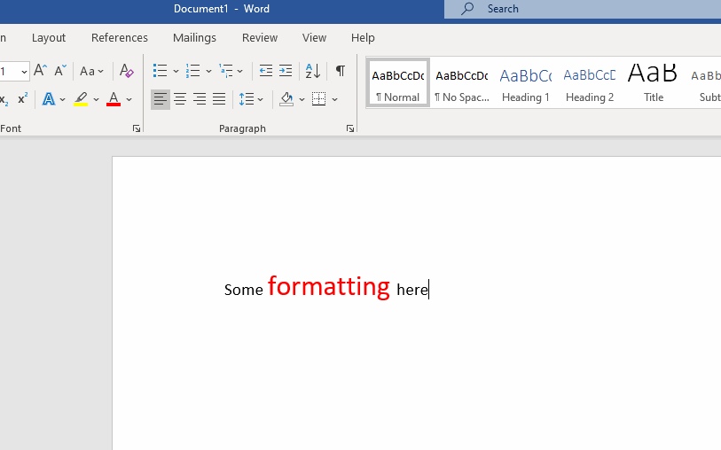
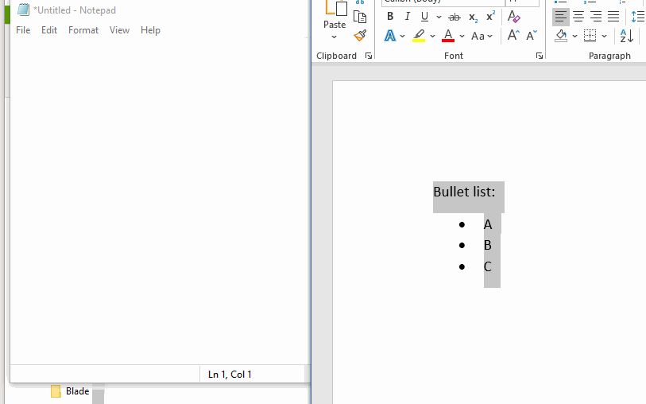
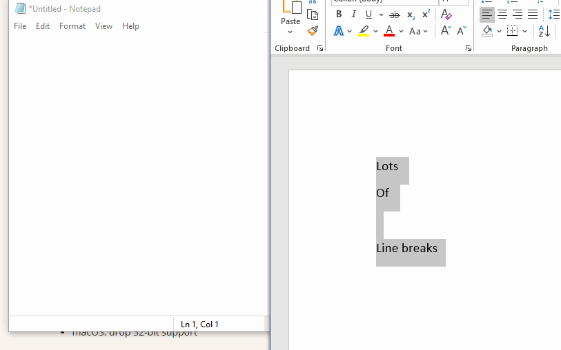
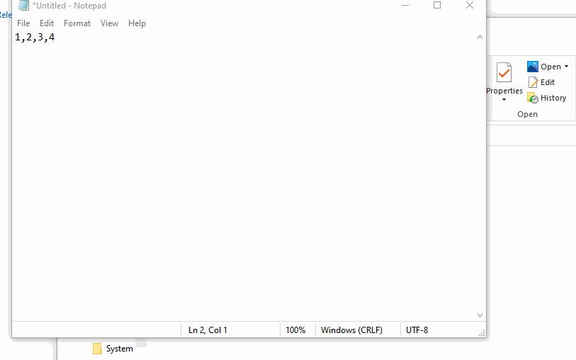
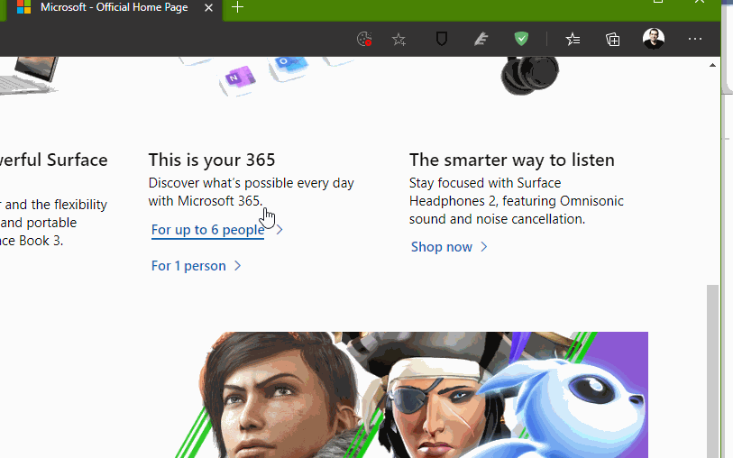

# CleanPaste
An unofficial, unsupported, overly simplistic tool for cleaning formatting from copy/paste operations

## How does it work?

The tool can do a few simple, but useful tasks:

1-Remove basic formatting from some text when you copy and paste:

2-Remove formating and unicode characters:

3-Remove line breaks:

4-Add line breaks after specific strings:

5-Extract HTML markups when copying:

## How do I use it?

Once you run the app, an icon will show in the tray icons area. You can right-click into settings and change the behaviors.

Whenever you want to paste some content, use Ctrl + Shift + V (this is hard coded for now, not configurable).

## How do I install it?

You can either take the installer from the release folders here: https://github.com/matvelloso/CleanPaste/releases

Or you can git clone the main branch, build it in Visual Studio and run it yourself :)

## Can I send a pull request to fix the mess you just made?

You are more than welcome to do so.

